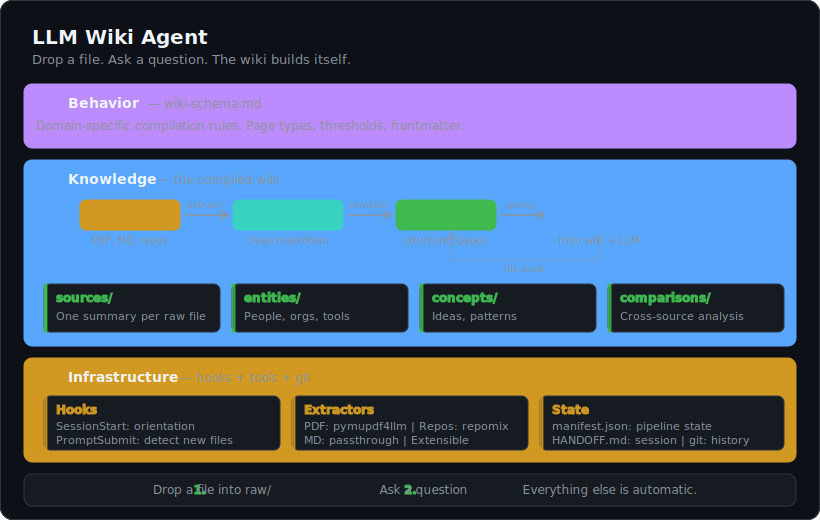

# LLM Wiki Agent

A Claude Code project agent that maintains a **compiled markdown wiki** as a knowledge base. Drop a file, ask a question — the wiki builds itself.

No plugins. No frameworks. No RAG. Just `CLAUDE.md` + hooks + a few extraction tools.

<p align="center">
  
</p>

> Interactive version: [`llm-wiki-architecture.jsx`](llm-wiki-architecture.jsx) (React component, dark/light theme support)

---

## How It Works

**Two human actions:**

1. Drop a file into `raw/` (PDF, markdown, or tell the agent a repo URL)
2. Ask a question

**Everything else is automatic:**

- Hooks detect new files on session start and on every prompt
- Extraction tools convert sources to clean markdown
- The agent compiles structured wiki pages (sources, entities, concepts, comparisons)
- Domain questions are answered by consulting the wiki
- Valuable answers can be filed back into the wiki (compounding loop)
- Git commits track every change

## Architecture

```
L2: BEHAVIOR  — wiki-schema.md (domain rules, pluggable per project)
L1: KNOWLEDGE — raw/ → extract → compile → wiki/ (the compiled wiki)
L0: INFRA     — hooks + extraction tools + git
```

The engine (`CLAUDE.md` + hooks + tools) is generic. The domain rules (`wiki-schema.md`) are the only file you customize per project.

## Quick Start

```bash
# Clone the template into your project
git clone https://github.com/gal-Tab/agent_knowledgebase.git my-project-kb
cd my-project-kb

# Install dependencies
./setup.sh

# Drop a source file
cp ~/papers/interesting-paper.pdf raw/

# Start Claude Code — the agent takes it from here
claude
```

## File Structure

```
project-root/
├── .claude/
│   ├── settings.json          # Hook config (SessionStart + UserPromptSubmit)
│   └── hooks/
│       └── kb-hook.sh         # Single script: file detection + orientation
│
├── raw/                       # Drop files here
│   ├── .manifest.json         # Pipeline state tracker
│   └── .extracted/            # Auto-generated clean markdown
│
├── wiki/                      # Agent-maintained (never edit directly)
│   ├── index.md               # Content catalog
│   ├── sources/               # One summary per raw source
│   ├── entities/              # People, orgs, products, tools
│   ├── concepts/              # Ideas, frameworks, patterns
│   └── comparisons/           # Cross-source analysis
│
├── tools/
│   ├── extract-pdf.py         # pymupdf4llm wrapper
│   └── extract-repo.sh        # repomix wrapper
│
├── wiki-schema.md             # Domain rules (THE pluggable part)
├── CLAUDE.md                  # Agent brain
├── HANDOFF.md                 # Session persistence
└── setup.sh                   # Install deps
```

## Supported Formats

| Format | Tool | Status |
|--------|------|--------|
| PDF | pymupdf4llm | Day 1 |
| Markdown / Text | passthrough | Day 1 |
| Git repos | repomix | Day 1 |
| EPUB | pandoc | Planned |
| HTML / URLs | trafilatura | Planned |
| CSV / XLSX | pandas | Planned |
| YouTube | yt-dlp | Planned |
| DOCX | pandoc | Planned |

Adding a format = one extraction script + one line in CLAUDE.md.

## How the Wiki Compiles

**Two-phase compilation:**

1. **Source page** — The agent reads the extracted markdown and creates `wiki/sources/{slug}.md` with a structured summary + a list of candidate entities and concepts
2. **Resolution** — For each candidate, the agent checks `wiki/index.md`. If a page exists, it updates it. If new and above threshold, it creates it. Then cleans up, updates the index, and commits.

**Thresholds** (defined in `wiki-schema.md`):
- Entity pages: created if central to a source OR mentioned in 2+ sources
- Concept pages: only for domain-specific or novel concepts
- Comparison pages: only on explicit request or when sources conflict

## Scaling

| Wiki Size | Strategy |
|-----------|----------|
| 0–100 pages | Flat `index.md`, agent reads it in full |
| 100–300 pages | Auto-splits into category sub-indexes |
| 300+ pages | `grep`-based search before reading indexes |

The agent handles tier transitions automatically during compilation.

## State Management

Three sources of truth, three concerns:

| What | Where | Tracks |
|------|-------|--------|
| Pipeline state | `raw/.manifest.json` | Which files extracted/compiled, content hashes |
| Session state | `HANDOFF.md` | What happened, what's pending, active threads |
| Change history | `git log` | Full audit trail with structured commit messages |

## Customizing for Your Domain

Edit `wiki-schema.md` to define:
- What entity types matter (people? companies? APIs? chemical compounds?)
- What sections each page type should have
- Thresholds for page creation
- Domain-specific compilation rules

The rest of the template stays unchanged.

## Inspired By

- [Karpathy's LLM Knowledge Bases](https://gist.github.com/karpathy/442a6bf555914893e9891c11519de94f) — the "compiled wiki" pattern
- [Cole Medin](https://github.com/cole-medin) — git-as-memory approach
- [CandleKeep](https://getcandlekeep.com) — auto-detection model
- [rvk7895/llm-knowledge-bases](https://github.com/rvk7895/llm-knowledge-bases) — reference implementation

## License

MIT
